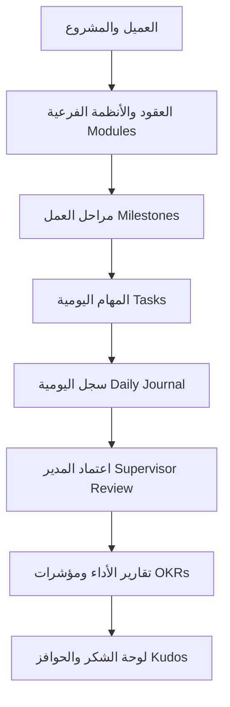
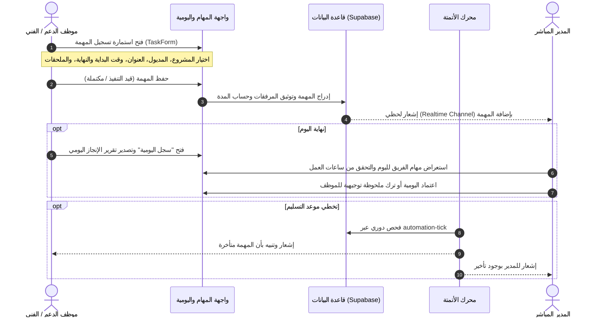
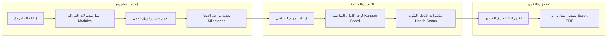
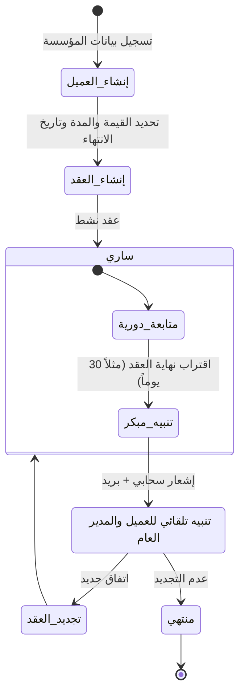
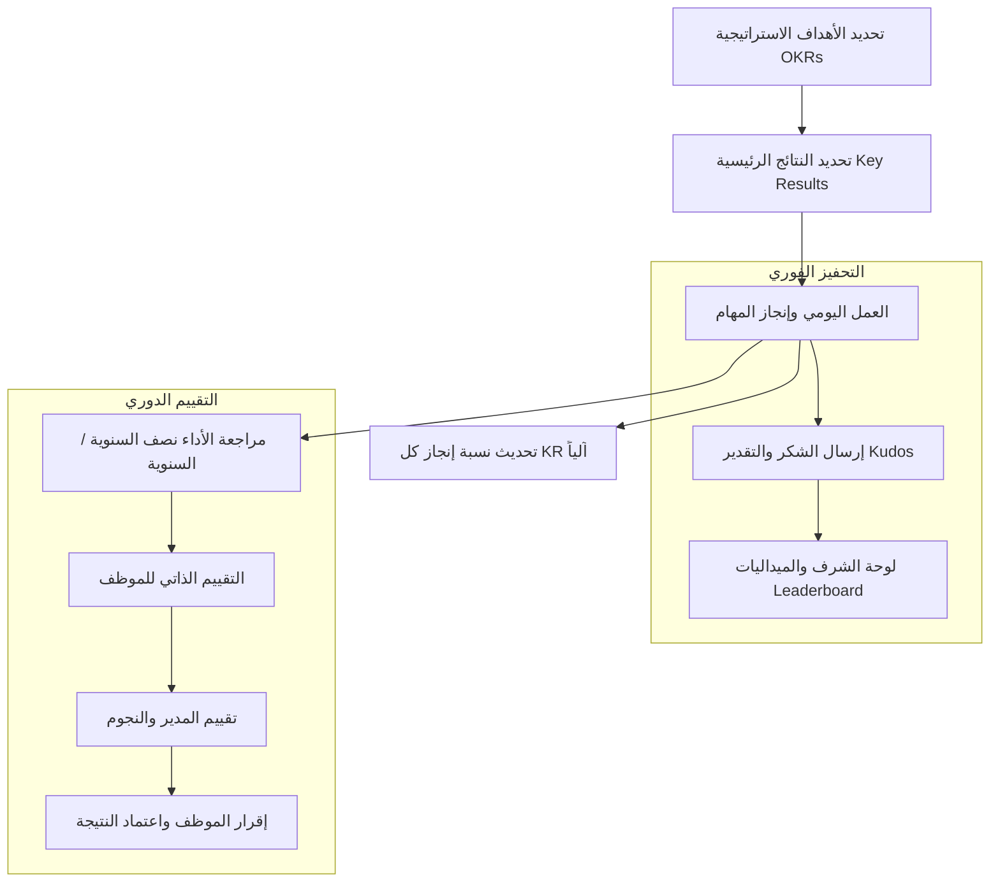

# خطة التطوير الشاملة وخريطة سير العمل (Enterprise Workflow & Development Plan)
## نظام إدارة علاقات العملاء والعمليات المؤسسية — C-SmarX / TaskFlow Hub

---

## 1. الرؤية ونطاق النظام (System Vision & Scope)

يعمل نظام **TaskFlow Hub (C-SmarX)** كمنصة سحابية متكاملة مصممة للشركات والمؤسسات الكبرى العاملة في مجالات:
1. **تطوير وتطبيق أنظمة تخطيط الموارد (ERP Systems)**.
2. **تشغيل وإدارة المنصات التعليمية (Learning Management Systems - LMS)**.
3. **الدعم الفني، وخدمة العملاء، وإدارة عقود الصيانة والمشاريع**.

يوفر النظام حلقة وصل محكمة بين **فريق العمل الفني والدعم** (الذين يسجلون مهامهم اليومية وإنجازاتهم بدقة)، و**الإدارة المباشرة والإدارة العليا** (التي تتابع مؤشرات الإنجاز، ومطابقة ساعات العمل، وسلامة العقود، وأداء الموظفين لحظياً).

---

## 2. الهيكل الإداري والأدوار (Organizational Hierarchy & RBAC)

| الدور (Role) | الصلاحيات والمسؤوليات | نطاق الرؤية والتحكم |
| :--- | :--- | :--- |
| **المشرف العام (Admin)** | إدارة إعدادات النظام، ومزودات البريد (SMTP)، والأمان، وسجلات التدقيق، وحذف البيانات الحساسة | صلاحية كاملة على مستوى النظام بالكامل |
| **المدير العام (General Manager)** | الإشراف الشامل على جميع المشاريع، والعملاء، ومؤشرات الأداء، وتقارير المؤسسة، وتوزيع الميزانيات | رؤية شاملة لكافة الأقسام والمشاريع |
| **مدير الفريق / القطاع (Manager)** | إدارة مشاريع محددة، مراجعة واعتماد مهام الفريق، تقييمات الأداء الدورية، تعيين أعضاء الفريق | نطاق المشاريع والفرق التابعة له مباشرة |
| **موظف الدعم / الفني (Support / Employee)** | تسجيل المهام اليومية، توثيق جلسات العمل، إرفاق المستندات والصور، استعراض مهامه ومؤشراته الخاصة | مهامه ومشاريعه المشترك بها فقط |

---

## 3. خرائط سير العمل المتكاملة (End-to-End Workflows)

### 3.1. دورة حياة المهمة وسجل اليومية (Daily Task & Work Journal Lifecycle)

### 3.2. دورة إدارة المشاريع والأنظمة (Projects & Modules Pipeline)

### 3.3. دورة إدارة العقود والعملاء (Clients & Contracts Pipeline)

### 3.4. دورة تقييم الأداء والتحفيز (Performance, OKRs & Recognition)

---

## 4. المراحل التنفيذية المكتملة بنجاح (Completed Enterprise Phases)

### 1. البيانات التأسيسية للمنظومة (Enterprise Demo & Seed Data) ✅
- هيكل أقسام متدرج (الإدارة العامة، قطاع تطوير البرمجيات، قطاع الدعم، إدارة الجودة).
- موديولات أنظمة C-SmarX ERP و Classera LMS المتكاملة.
- مشاريع كبرى وعقود صيانة ومهام نموذجية مربوطة بالمستخدم الرئيسي.

### 2. دورة اعتماد سجل اليومية (Daily Work Journal & Manager Review) ✅
- استعراض فوري لليومية من لوحة التحكم مع مؤشرات الإنجاز وساعات العمل.
- إرسال اليومية للاعتماد (`submitted`) مع إشعارات للمدير المباشر.
- مراجعة المدير (`approved` / `revision_requested`) مع كتابة ملاحظات التوجيه.
- طابور مراجعة لحظي للمديرين في لوحة الفريق.

### 3. محرك تذاكر الدعم واتفاقيات الـ SLA (Support Tickets & SLA Hub) ✅
- شاشة مركزية لإدارة تذاكر الدعم الفني لعملاء ERP و LMS على مسار `/tickets`.
- تتبع حي لاتفاقيات مستوى الخدمة SLA (الاستجابة والحل) وعداد زمني لحساب الساعات المتبقية.
- سجل محادثات فنية وتحديثات حالة وملاحظات داخلية للفريق التقني.

### 4. مركز التقارير التنفيذية والطباعة الرسمية (Executive PDF Reports) ✅
- محرك طباعة تقارير تنفيذي متقدم يدعم الخطوط العربية الرسمية (Tajawal) وهوية C-SmarX.
- طباعة وتصدير تقرير يومية العمل المعتمدة متضمناً ختم وتوقيع الاعتماد الإداري.
- طباعة تقارير الأداء التشغيلي والمهام الشهرية وجلسات الأنظمة مع كروت الـ KPIs.
- طباعة تقرير امتثال تذاكر الدعم واتفاقيات الـ SLA.

### 5. محرك الأتمتة والتنبيهات المجدولة (Automated Alerts & Cron Engine) ✅
- فحص آلي لخرق اتفاقيات مستوى الخدمة (SLA Response & Resolve Breach).
- تحذيرات استباقية قبل انتهاء مهلة حل التذكرة بساعتين.
- تنبيهات يومية للموظفين لرفع سجل اليومية للمدير المباشر.
- لوحة إدارة قواعد الأتمتة على مسار `/settings/automation` وتوثيق سجلات التشغيل.

---

## 5. معايير الجودة والأمان البرمجية (Engineering & Quality Standards)
* **TypeScript & Zero Errors**: الحفاظ الدائم على `tsc --noEmit` بنسبة نجاح 100%.
* **RTL & Design Excellence**: الالتزام الصارم بقواعد اللغة العربية واستخدام تباعدات `ms-*` و `me-*` وألوان حديثة.
* **الأمان السحابي (RLS)**: تفعيل سياسات Row-Level Security على كافة الجداول لضمان عزل بيانات كل مستخدم وفريقه بدقة.
* **اختبارات الاستقرار**: استمرار تغطية اختبارات Vitest التلقائية مع كل تحديث أو دمج.
